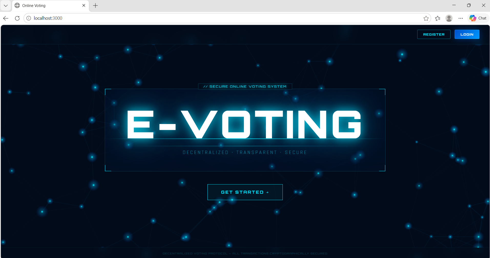
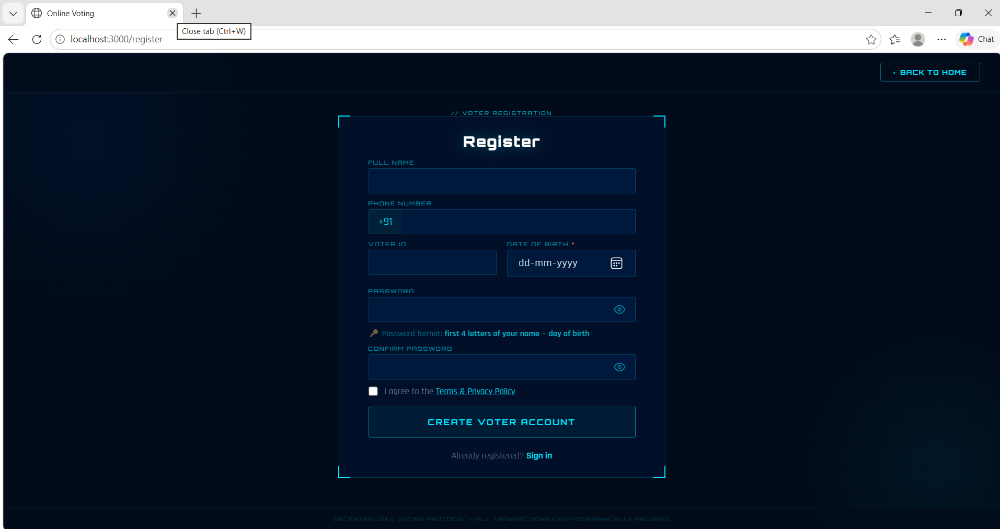
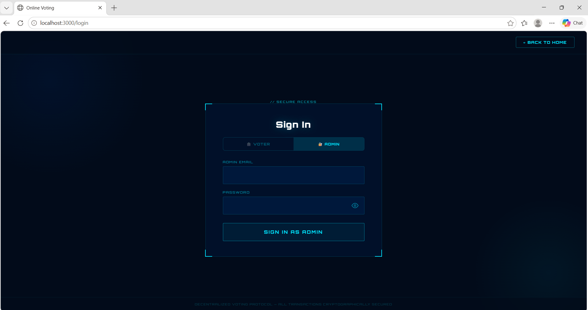
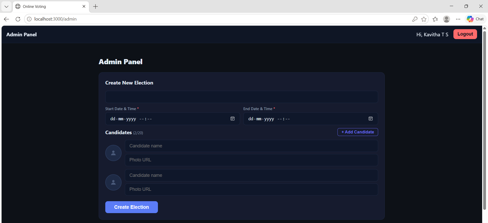
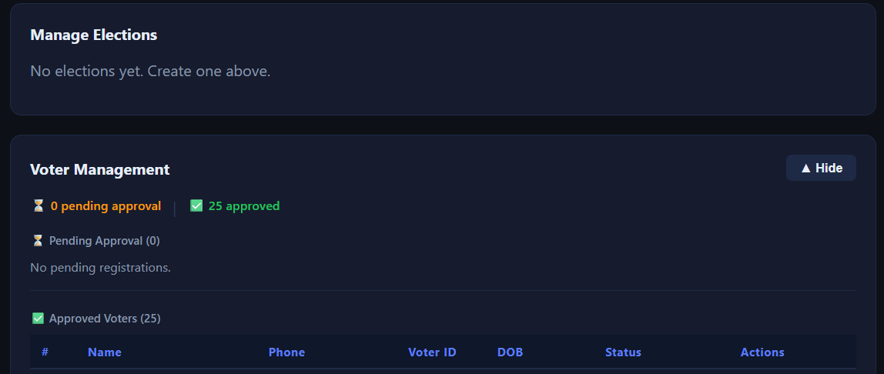
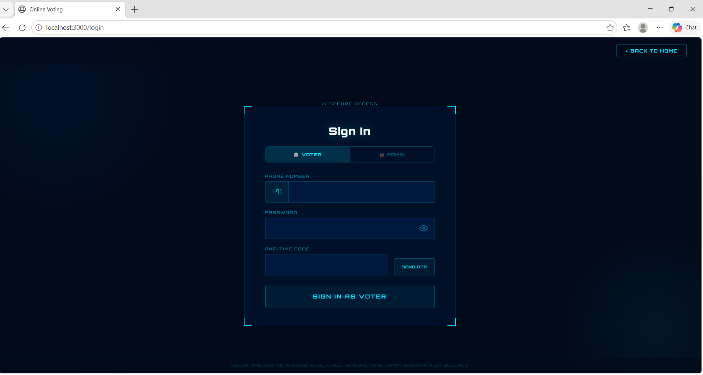
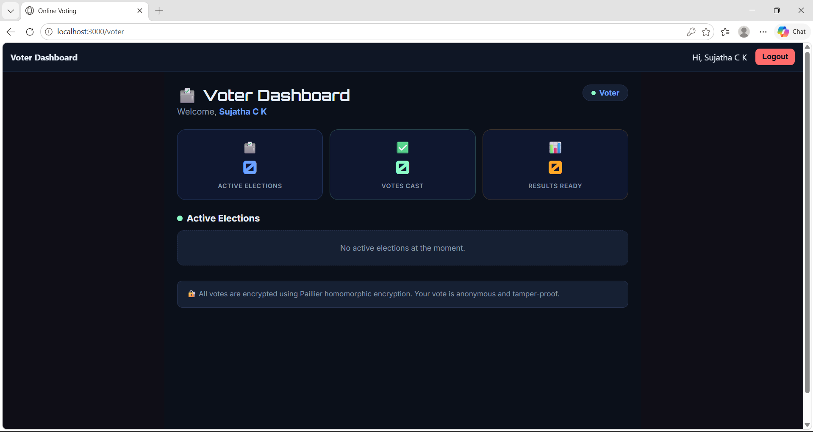

# SecureVote — Privacy-Preserving Online Voting System

A full-stack web-based electronic voting system built with React and Flask, using **Paillier Homomorphic Encryption** and **Shamir Secret Sharing** to ensure votes remain private even during counting.

---

## Features

- Voter self-registration with admin approval workflow
- Three-factor authentication: phone number + password + SMS OTP (Twilio)
- Client-side vote encryption using Paillier homomorphic encryption
- Threshold decryption via Shamir Secret Sharing (no single point of trust)
- Public bulletin board for auditability
- Duplicate vote prevention (one vote per user per election)
- Admin dashboard: create, edit, delete, and tally elections
- Election scheduling with configurable start and end times (UTC/IST)
- Up to 20 candidates per election with photo support
- Live results with bar chart, winner detection, and tie handling
- Supports SQLite (default) and MySQL

---

## Tech Stack

| Layer | Technologies |
|---|---|
| Frontend | React.js, React Router DOM, Axios, Crypto-JS |
| Backend | Python, Flask, Flask-JWT-Extended, Flask-CORS |
| Database | SQLite (default) / MySQL |
| Cryptography | Paillier (`phe`), Shamir Secret Sharing |
| OTP | Twilio SMS |

---

## Project Structure

```
Online-Voting-System/
├── backend/
│   ├── core/
│   │   ├── app.py          # Flask routes
│   │   ├── auth.py         # OTP generation and verification
│   │   ├── crypto.py       # Paillier encryption / Shamir sharing
│   │   ├── models.py       # DB models (SQLite + MySQL)
│   │   └── verify.py       # Post-election verification tool
│   ├── run.py
│   └── requirements.txt
├── frontend/
│   └── src/
│       └── components/
│           ├── LandingPage.js
│           ├── Register.js
│           ├── Login.js
│           ├── AdminPanel.js
│           ├── VoterPanel.js
│           ├── VoteForm.js
│           ├── Results.js
│           └── ElectionList.js
├── database/
│   └── schema.sql
├── assets/
│   └── screenshots/
└── package.json            # Root: runs both servers together
```

---

## Setup

### 1. Clone the repository

```bash
git clone https://github.com/kavithasiddesh2003-collab/Online-Voting-System.git
cd Online-Voting-System
```

### 2. Configure environment

```bash
cp backend/.env.example backend/.env
```

Edit `backend/.env` and fill in your values:

```env
JWT_SECRET_KEY=your-secret-key
OTP_HMAC_SALT=your-otp-salt
HMAC_SIGNING_KEY=your-signing-key

# Twilio (for SMS OTP)
TWILIO_ACCOUNT_SID=...
TWILIO_AUTH_TOKEN=...
TWILIO_PHONE_NUMBER=...

# MySQL (optional — omit to use SQLite)
MYSQL_HOST=127.0.0.1
MYSQL_PORT=3306
MYSQL_USER=root
MYSQL_PASSWORD=
MYSQL_DATABASE=securevote
```

### 3. Install dependencies

```bash
# Backend
pip install -r backend/requirements.txt

# Frontend
npm install
npm run install:frontend
```

### 4. Run the app

```bash
# Both backend + frontend together (recommended)
npm start

# Or separately
python backend/run.py        # Flask on http://localhost:5000
cd frontend && npm start     # React on http://localhost:3000
```


---

## Voter Seeding (Optional)

To pre-load voters, place a `database/users.csv` file with columns:

```
name,phone,role,email,password,voter_id,dob
```

- Voters need: `name`, `phone`, `voter_id`, `dob`
- Admin needs: `name`, `email`, `password`, `role=admin`
- Voter password is auto-generated as `first4letters_of_name + day_of_dob` if not provided

> ⚠️ `database/*.csv` is gitignored. Never commit real personal data to the repository.

To sync the database with an updated CSV from the admin panel, use **Admin → Reload Users**.

---

## System Workflow

1. Admin creates an election, sets candidates, start time, and end time
2. A Paillier keypair is generated; the private key is split via Shamir Secret Sharing
3. Voters self-register (pending admin approval) or are pre-seeded via CSV
4. Voter authenticates with phone + password + SMS OTP
5. Vote is encrypted client-side before being sent to the server
6. Encrypted ballot is stored on the public bulletin board
7. After the election ends, admin tallies using threshold decryption
8. Results are displayed as a bar chart; individual votes are never revealed

---

## Post-Election Verification

```bash
python backend/core/verify.py --election_id 1
```

Verifies the bulletin board integrity and confirms tallied results match encrypted ballots.

---

## Screenshots

| | |
|---|---|
|  |  |
|  |  |
|  |  |
|  | |

---

## Security Notes

- `.env` files, `.db` files, `bulletin.json`, `trustee_keys.json`, `private_ledger.json`, and all CSVs are gitignored
- Never commit real voter data or credentials to the repository
- Change all default keys in `.env.example` before deploying
- OTP attempts are rate-limited and stored in a separate SQLite DB (`otp_store.db`)

---

## Future Improvements

- Blockchain-based bulletin board storage
- Biometric authentication
- Mobile app support
- Large-scale election scalability

---

## Author

Kavitha Siddesh — Final Year CS Project (SecureVote)